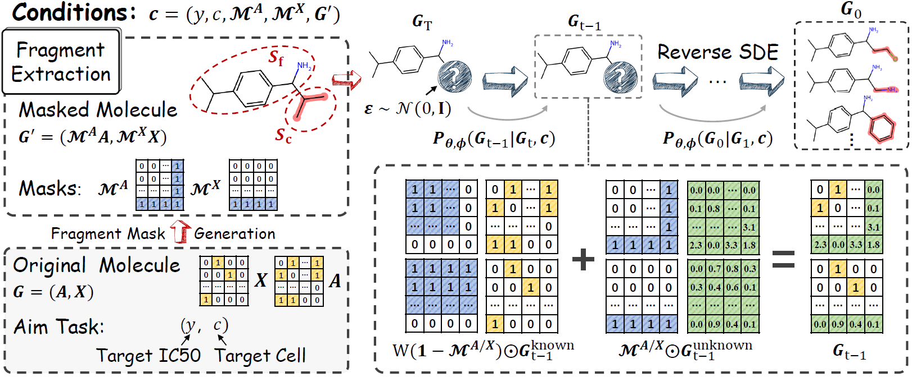
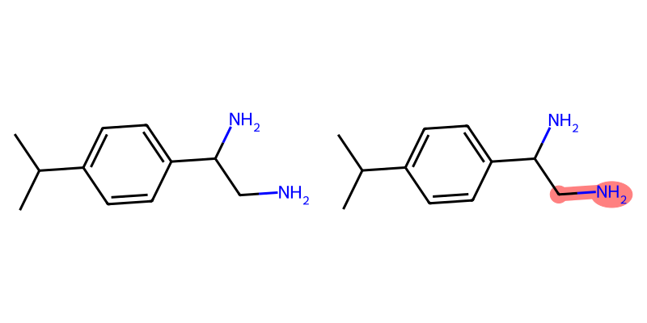
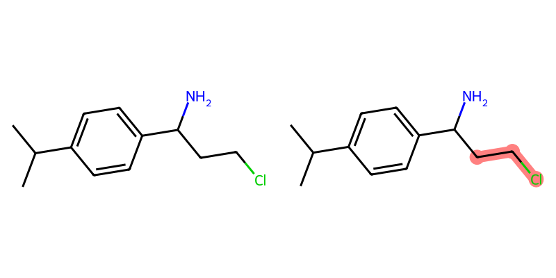

# FMOP: Fragment-masked Molecular Optimization


The pre-trained model is available on Google Drive: 
- [Apr03-06:33:01_163.pth](https://drive.google.com/file/d/1A3QC_GH36Z9PqBbLvkKbcB0eD0zTUGK5/view?usp=drive_link), put it in `../checkpoints/GDSCv2`,
- [CLDR_Mar12-07:01:52.pth](https://drive.google.com/file/d/1pzjX1BZY2sHp6SfY-UrbRf5jTp-QUwDI/view?usp=drive_link), put it in `../data`,
- [gdscv2.csv](https://drive.google.com/file/d/1M7RmBe0byGF1SBfYcaof7V3Z-RO1jF-y/view?usp=drive_link), put it in `../data`
- [PANCANCER_Genetic_feature.csv](https://drive.google.com/file/d/162eB0mSiaPHzjDNBAK2Kve9rT_4qqSXO/view?usp=drive_link), put it in `../data`
- [valid_idx_gdscv2.json](https://drive.google.com/file/d/19N1L6l52cVgti_IU2sL4F67PHF0Xfuoa/view?usp=drive_link), put it in `../data`

## Framework

<p align="center">
  
</p>

## Dependencies

Please create an environment with **Python 3.8.18** and **Pytorch 2.0.1**, and run the following command to install the requirements:
```
torch-cluster                 1.6.1+pt20cu117                                                                                                                                                                    torch-fidelity                0.3.0                                                                                                                                                                              torch-geometric               2.3.1                                                                                                                                                                              torch-scatter                 2.1.1+pt20cu117                                                                                                                                                                    torch-sparse                  0.6.17+pt20cu117
torch-spline-conv             1.2.2+pt20cu117
```
```
conda install -c conda-forge rdkit=2023.3.3
```


## Main Optimization Command:
The primary command for optimization is:

```bash
CUDA_VISIBLE_DEVICES=1 python main.py --type drp_condition_sample --config ./config/sample_gdscv2.yaml --condition 1.0
```


### Key Code Segment from `main.py`:
```python
model_type = 'multimolgen'
```

### Modes:
1. **`multimolgen` Mode**: 
   - This mode optimizes a batch of molecules across 945 cell lines.

2. **`molgen` Mode**: 
   - This mode optimizes specific molecules and their fragments for a particular cell line defined in the config file.

## Steps of the given cell line for molecule optimization:

1. Run `./frag.ipynb` to generate the fragment breakdown of all molecules, resulting in \`break_mols_v2.json\`.
   
2. Run `python ./generate_config.py` to generate the relevant information for the molecules to be optimized, saved in \`ic50_result_dict_20_30.json\`. This JSON file contains data with IC50 values within a specified range (a%~b%), which can be defined by the user.
   
   
     ```python
     ic50_5_percentile = cell_line_data['ic50'].quantile(0.2)  # Line 44
     ic50_10_percentile = cell_line_data['ic50'].quantile(0.3)  # Line 46
     ```

## Visualization of Fragmented Molecules:

<p align="center">
  
  
</p>

